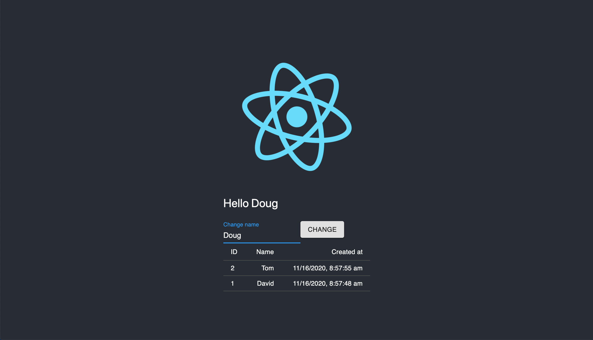

# Introduction

The [cloud-native landscape](https://landscape.cncf.io/) is full of powerful tools, but this landscape is constantly changing and the tools aren't designed for the every day developer. If developers hope to take advantage of modern design patterns, they need a framework designed for them instead of the endless landscape of operator-focused tools being forced upon them.

Architect is a self-service developer platform for cloud-native applications – enabling continuous delivery, [service discovery](/docs/components/service-discovery), and continuous security all at once. We've taken inspiration from our experiences in big tech and at startups alike to create an simple, developer-focused framework that allows developers to build and extend cloud services like never before.

## First steps

The best way to learn how Architect works is through practice, and we've curated a simple set of steps you can follow to get you started:

- [Introduction](#introduction)
  - [First steps](#first-steps)
  - [Install the CLI](#install-the-cli)
  - [Run a sample component](#run-a-sample-component)
    - [Clone the repository](#clone-the-repository)
    - [Register the app locally](#register-the-app-locally)
    - [Check out the architect.yml file](#check-out-the-architectyml-file)
    - [Run the component](#run-the-component)
  - [Make your own changes](#make-your-own-changes)
  - [Create a free Architect account](#create-a-free-architect-account)
  - [Register a component](#register-a-component)
  - [Deploy to the cloud](#deploy-to-the-cloud)

## Install the CLI

The best way to install the CLI is via NPM:

```bash
$ npm install -g @architect-io/cli
```

If you hit a permission issue with writing to node_modules try:
```bash
$ sudo npm install -g @architect-io/cli
```

Alternatively, you can download the binary for your system architecture from [Github](https://github.com/architect-team/architect-cli/releases/latest). Just download the appropriate bundle, extract it, and link the included `bin` folder to your user home directory.

## Run a sample component

In order to help you get familiar with Architect, we've created several [example applications](//github.com/architect-team/architect-cli/tree/master/examples) for you to experiement with. In this walk through, we'll use the react demo application which comes with a frontend Next.js app, a backend Node.js API, and a postgres database – all of which will be deployed automatically via Architect:



### Clone the repository

The examples live in a sub-folder of our CLI's repository, so go ahead and clone the repo locally:

```sh
$ git clone https://github.com/architect-team/architect-cli.git && cd ./architect-cli/
```

### Register the app locally

Next you'll want to link the react application to your local registry. Linking helps the CLI find the component by name on the local file system, otherwise it would look to find the component in Architects component registry.

```sh
$ architect link ./examples/react-app/
```

### Check out the architect.yml file

The `architect.yml` file contains the component descriptors that power Architect deployments. Why don't you open up the file in our react-app example:

```yaml{numberLines: 1}
name: examples/react-app

parameters:
  world_text:
    description: Default greeting text for the landing page
    default: world
  root_db_user:
    description: Root user to assign to the generated database
    default: postgres
  root_db_pass:
    description: Root password to assign to the generated database
    default: architect
  api_db_name:
    description: Name of the database used by the API
    default: test_database

services:
  # Describes the database service
  api-db:
    image: postgres:11
    interfaces:
      postgres:
        port: 5432
        protocol: postgres
    environment:
      POSTGRES_USER: ${{ parameters.root_db_user }}
      POSTGRES_PASSWORD: ${{ parameters.root_db_pass }}
      POSTGRES_DB: ${{ parameters.api_db_name }}

  # Describes the Node.js backend API
  api:
    build:
      context: ./backend
    interfaces:
      main: &api-port 8080
    environment:
      PORT: *api-port
      DB_ADDR: ${{ services.api-db.interfaces.postgres.url }}
      DB_USER: ${{ parameters.root_db_user }}
      DB_PASS: ${{ parameters.root_db_pass }}
      DB_NAME: ${{ parameters.api_db_name }}
    # The debug block defines features only used for local deployments. In this
    # case, we've mounted to src directory and instrumented a hot-reloading cmd
    ${{ if architect.environment == 'local' }}:
      command: npm run start:dev
      volumes:
        src:
          mount_path: /usr/src/app/src
          host_path: ./backend/src

  # Describes the Next.js frontend application
  app:
    build:
      context: ./frontend
    interfaces:
      main: &app-port 8080
    environment:
      PORT: *app-port
      API_ADDR: ${{ services.api.interfaces.main.url }}
      WORLD_TEXT: ${{ parameters.world_text }}
    ${{ if architect.environment == 'local' }}:
      build:
        dockerfile: Dockerfile.dev
      volumes:
        src:
          mount_path: /usr/src/app/src
          host_path: ./frontend/src

# Maps the frontend application to an external interface. Once running, it can
# be resolved at http://app.arc.localhost
interfaces:
  app: ${{ services.app.interfaces.main.url }}
```

This `architect.yml` describes each of our three `services`, exposes the frontend externally via `interfaces`, and allows the root DB credentials to be configured via `parameters`.

### Run the component

Now that we have a better understanding of what we're deploying, let's go ahead and start it up!

```sh
$ architect dev examples/react-app:latest -i app:app

Using locally linked examples/react-app found at /architect-cli/examples/react-app
http://app.arc.localhost:80/ => examples--react-app--app--latest--aklmrtvo

http://localhost:50000/ => examples--react-app--api-db--latest--arrm58dc
http://localhost:50001/ => examples--react-app--api--latest--1dzvo47x
http://localhost:50002/ => examples--react-app--app--latest--aklmrtvo
http://localhost:80/ => gateway
# begin log stream...
```

The command above will transform the component into a fully enriched docker-compose template and then execute it automatically. After a few seconds you should see the each application indicate that its ready for traffic, and at that point you can open http://app.localhost in your browser!

## Make your own changes

As you may have noticed from the `architect.yml` file, we've included a `debug` block that enables hot-reloading for each service. That means you can make changes to the source code for each project and the changes will be applied to the environment automatically.

Why don't we try making some changes to `./frontend/src/components/NameComponent.jsx`. Find the line that says:

```jsx
Hello {this.state.changed_name}
```

and change it to say:

```jsx
Hi there {this.state.changed_name}
```

Once you save the file, you'll see the frontend service recompiling in the logs and then your browser window will update automatically.

## Create a free Architect account

Now that you've successfully run and edited a component locally, it's time to learn how to register the component and deploy it to cloud environments. Before you can do that however, you need to [sign up](//cloud.architect.io/signup) for Architect and create an account that will house your components and environments.

After you've signed up, you simply need to login via the CLI to allow for access to your account:

```sh
$ architect login
```

## Register a component

Before we can deploy to a cloud environment, we have to register and tag our component with Architects component registry. Components are registered to the account indicated by the name prefix of each component. The component we've been using as an example is called `examples/react-app`, but lets go ahead and change the account prefix before registering. Open up the `architect.yml` file and change the name to something of your choosing. Once that's complete, you can register the component with a single command:

```sh
$ architect register ./examples/react-app/ --tag latest
```

The `register` command does three things: 1) build any services with a `build` and replace the field with an `image` field referencing the built artifact, 2) upload any build artifacts to Architect's registry, and 3) register the component itself with Architect. Once complete, you'll see a link to the newly registered component!

## Deploy to the cloud

Finally, you're ready to deploy! Each Architect account comes pre-registered with an environment named, `example-environment`, that leverages Architect as the hosting provider. Lets go ahead and deploy our component to it (be sure to replace `<my-account>` with the name of the account you registered your component to):

```sh
$ architect deploy <my-account>/react-app:latest \
    --account <account-name> \
    --environment example-environment \
    -i app:app
```

Nice work! Now that you've gotten the hang of the deploy flow, you're probably ready to try it out with your own application. Head on over to the [configuration](/docs/configuration) section to learn more about the `architect.yml` file and how to write one of your own:
