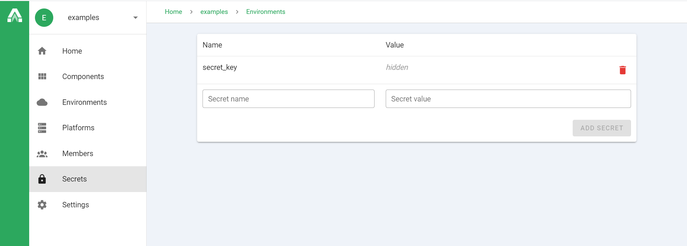

# Secret management

> Sensitive parameters should never be checked into version control.

Architect Cloud has built-in secret management for sensitive parameters.
Secrets can be set at the account or environment scope and will only be read at deploy time. Account scoped secrets apply to all environments, but can be overriden at the environment scope.

### Example:
We want to deploy a component with a sensitive parameter `secret_key`:
```yaml
# architect.yml
name: examples/component
parameters:
  secret_key:
    required: true
services:
  api:
    environment:
      SECRET_KEY: ${{ parameters.secret_key }}
```
Deploying will fail prompting us to provide a parameter:
```sh
$ architect register -c architect.yml -a <account-name>
$ architect deploy examples/component:latest -a <account-name> -e <environment-name>
 »   Error: {
 »     "components.examples/component.parameters.secret_key": {
 »       "Required": "secret_key is required",
 »     }
 »   }
```
To utilize the Architect secret manager navigate to your account or environment page for the component. Click on the secrets tab located on the left sidebar. Add a secret with the same name as the sensitive parameter. In this case it would be `secret_key`.



Now that we added our secret the deploy should work without issue:
```sh
$ architect deploy examples/component:latest -a <account-name> -e <environment-name>
 » Deploying...
```
