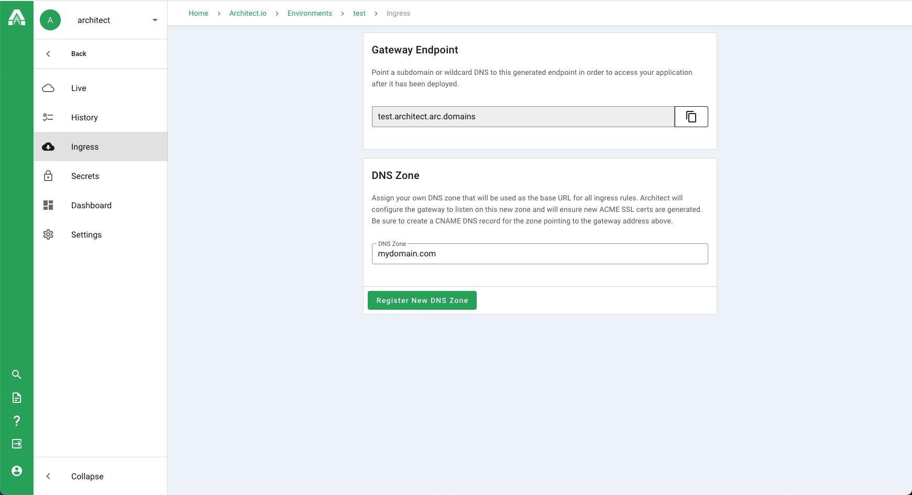
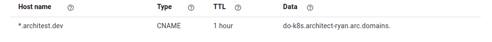

# Custom domains

A common requirement for teams using Architect in production is the ability to bring their own domain name. By connecting a domain name to your environment, Architect can automatically configure the environment's API gateway to use the domain to power the environment's ingress rules as well as create the certificate.

All you have to do is tell your environment which DNS zone to use for the ingress rules, and Architect will take care of the rest. Just navigate to your environment, click on "Settings" in the navigation bar, and the register your DNS zone in the "Custom DNS zone" form. Architect does NOT manage your DNS for you, so once registered you'll have to point the DNS zone to the gateway endpoint cited using a CNAME record.

Your DNS configuration for the environment settings above could look something like the setting below. If an application was exposed by Architect at any subdomain, It will be reachable at the same subdomain of the domain that you own.

