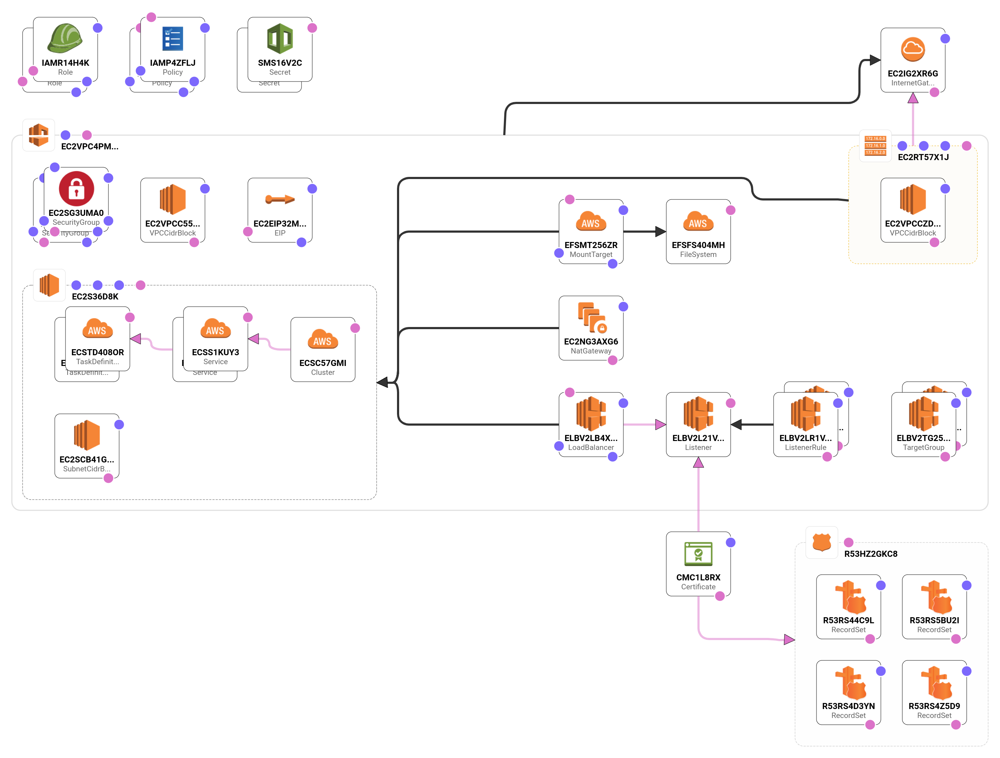
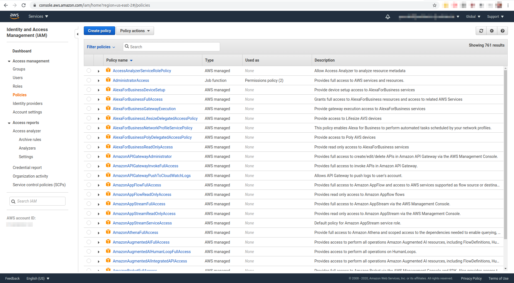
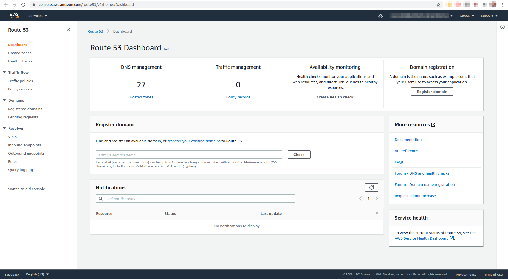
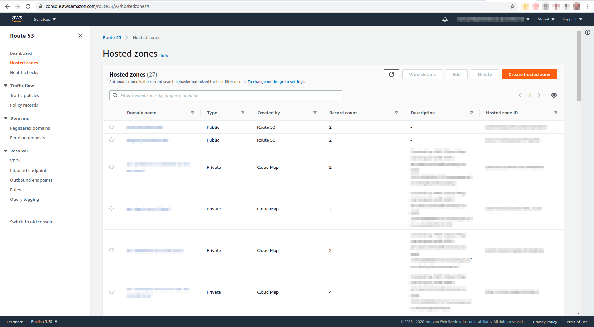
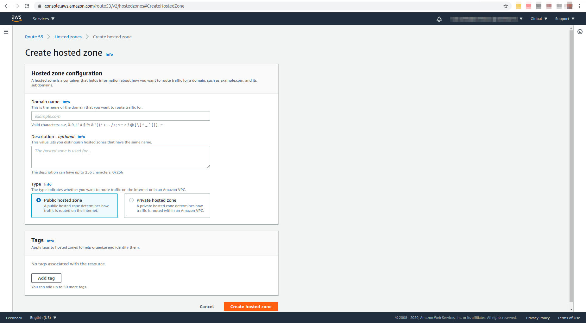
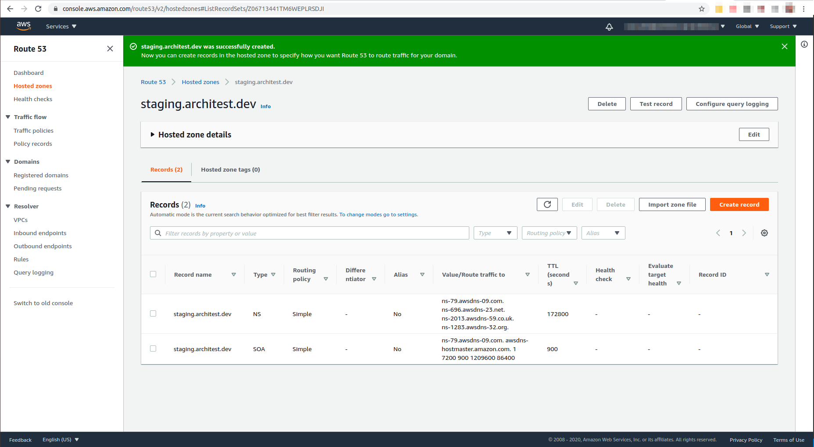

# Configuring AWS platforms

## Architect IAM policy

Architect deployments to the AWS ECS platform type will create a variety of services on your behalf in the availability zone provided when the platform was first created. In order to create these resources, your platform needs to be registered with an AWS account that has access to them. Here you'll learn what resources Architect may seek to provision on your behalf so that you can create an IAM policy that allows Architect to create them.

### Required AWS services

* Load Balancer
* Security Group
* Cert Manager Certificate
* Task Definition
* Security Group
* ECS Service
* Secret Manager Secret / Secret Manager Secrete Version
* VPC
* Internet Gateway
* Subnet
* Elastic IP
* NAT Gateway
* IAM Role
* IAM Policy
* AMI
* Launch Configuration
* Autoscaling Group
* Security Group
* ECS Cluster
* Elastic File System
* Route 53 Hosted Zone
* Route 53 record
* CloudWatch Event Rule
* CloudWatch Event Target

A generalized architecture for an ECS deployment can be seen below. Amounts of resources vary, such as ECS Cluster Services, depending on the component(s) being deployed to the platform.

### The policy template

The easiest way to generate an IAM policy

An example policy can be found [here](https://api.architect.io/accounts/3ed6f3a7-28cf-49b6-88dd-0a54d319045d/aws-iam-policy?region=my_region&aws_account_id=my_account_id), where you simply need to replace `my_region` with your desired AWS region and `my_account_id` with your AWS account ID.

### Register the policy with AWS

<strong>1. Navigate to the IAM Dashboard</strong>

To add the IAM policy to your account, log in to the AWS console and navigate to the IAM dashboard at `https://console.aws.amazon.com/iam/home?region=your_target_region#/home`. `your_target_region` should be the same region that you plan to use to register your ECS platform with Architect (ex. us-east-2).

<strong>2. Create a policy</strong>

Select the blue "Create policy" button at the top of the page to create the required policy.

<strong>3. Select the JSON editor</strong>

On the "Create policy" page, select the JSON editor by clicking the "JSON" tab. This is where the previously-generated policy will be used. Be sure that you have replaced the defaults `my_region` and `my_account_id` with real values. Clear any existing default JSON, then paste the policy into the JSON editor. Select the blue "Review policy" button at the bottom of the page to review the policy that will be created.

<strong>4. Finish policy creation</strong>

On the "Review policy" page, add a policy name then select "Create policy" at the bottom right. You should have been taken back to the policy list page and there should be a message indicating successful policy creation at the top. You can now take this policy and add it to your IAM user.

## Using custom domains

Architect uses AWS Certificate Manager to validate and create certificates for your default and custom domains. If a custom domain is used, Architect needs to create a CNAME record for Certificate Manager to validate that you own the domain stated in your environment config file. To do so, a Route 53 hosted zone must exist in which to create this validation record. An NS record also needs to be created with the originator of the domain, assigning it to the hosted zone that has been defined.

<strong>1. Navigate to the Route53 Dashboard</strong>

In order to create a Route 53 hosted zone that corresponds to your custom domain, navigate to the Route 53 Dashboard at https://console.aws.amazon.com/route53/v2/home#Dashboard.

<strong>2. Creating a Route 53 hosted zone</strong>

On the left sidebar of the dashboard, select "Hosted zones". At the top right, select the orange "Create hosted zone" button.

<strong>3. Configuring a hosted zone</strong>

The hosted configuration page contains a form on which to enter your domain name. This would also be the custom domain specified in the environment config. Enter it in the "Domain name" field, then add a description if you would like. Be sure that the option "Public hosted zone" is selected for the "Type" field. Finally, select the orange "Create hosted zone" button at he bottom of the page.

<strong>4. Locating the AWS DNS servers</strong>

When the hosted zone is created, you should be automatically navigated to the page for that zone. Two records will be created by default, an SOA record and an NS record. For the NS record, the column "Value/Route traffic to" will be a list of four DNS server addresses. Take note of these to use in the next and final step.

<strong>5. Adding the NS record to your domain</strong>

Navigate to the DNS page for your domain. In the case of this guide, our domain was bought on Google Domains. Add a custom resource record of type "NS" with the same name that is both in your environment config as the custom domain and set as the name as the hosted zone. For the value of the record, add the DNS server addresses. Once that's done, you'll be ready to deploy. After deploying the component with the environment config above, the "api" service will be available with a validated certificate at https://api.staging.architest.dev.

