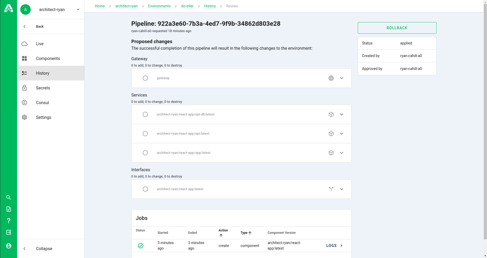
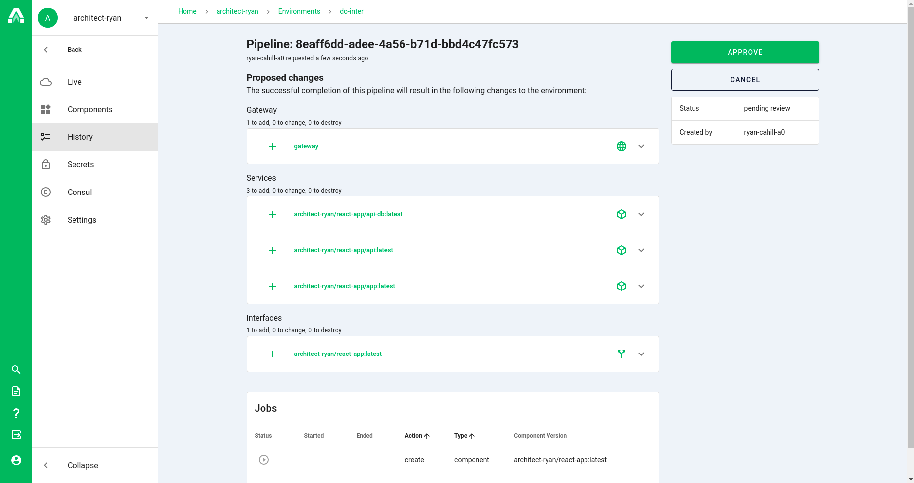

# Pipeline rollbacks

In an event that the current state of an environment isn't desired, Architect provides the ability to rollback to any prior state. In order to do this, navigate to the pipeline history by selecting the "History" tab on the sidebar of any environment page. This page shows a list of pipelines in chronological order and whether or not they were successful. Any successful pipeline can be reapplied. Details of any pipeline can be viewed by clicking "Review >" in any of the pipeline rows. If re-running the pipeline will create the desired state, rollback to it by clicking the "Rollback" button at the top right of the pipeline page. This will create a new pipeline to apply the changes which should be applied. If the pipeline review looks good, click the "Approve" button at the top right of the page to rollback. Changes can be viewed in real time either at the bottom of the pipeline review page or by clicking the "Live" tab on the left side of the page.

