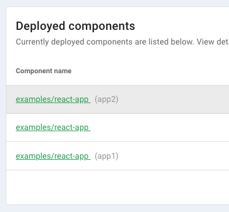

# Multi-Tenant Deployments

Though components support horizontal scaling through the replicas property, there are cases where you may want multiple separate deployments of a component in a single environment. The default deployment process will create an instance of the component as an unnamed global tenant, but you can deploy a separate instance by providing a tenanat name. Having multiple instances of a component deployed in this manner is called a "multi-tenant deployment".

```
architect-local deploy examples/react-app@app1
```

This process works for updating existing deployments as well. If an "app1" tenant of the `examples/react-app` component had already been deployed, the above command would have deployed to that same tenant, leaving any other instances of the component untouched.

## Deployments and Management Lifecycle

When you view your deployed components, you'll see that the react-app has the name "app1" whereas the typical deployment without a tenant name will show only the component. In this example we've deployed the example React App twice with the tenant names "app1" and "app2", and once without a tenant name.



## Secrets and Values

Configuring individual tenants works the same way as deploying those tenants: by providing the tenant name. Secrets use the component scopes to specify which values will be applied to which components, so setting a secret for a tenant is as simple as providing the tenant name in the component scope.

In the case of the example React App, the following will override the `world_text` secret for just the `sandiego` tenant.

```yaml
'examples/react-app@sandiego':
  world_text: San Diego
```

This enables minimal duplication of configuration, as you can specify any necessary values in a generic component scope, but then override specific values on a tenant-by-tenant basis. In the following example, the `planetearth` tenant would have the `foo` secret as configured in the first scope, but would have the overwritten values for `world_text` set in the second scope.

```yaml
'examples/react-app':
  foo: bar
  world_text: world!
'examples/react-app@planetearth':
  world_text: Planet Earth
```
