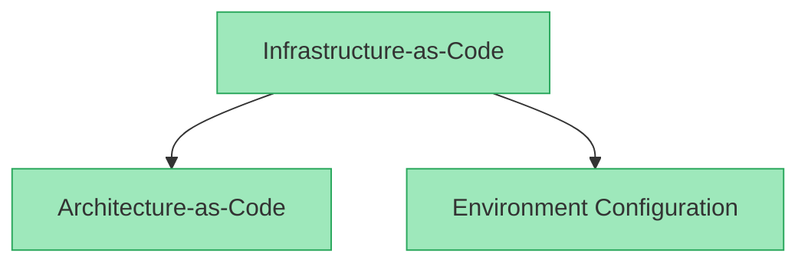

# Continuous Delivery

## What is Architecture-as-Code

It's a subset of infrastructure-as-code that focuses exclusively on the application design: runtime details, APIs that are exposed, and relationships between services and apps.

## Key features

### Write once, deploy anywhere

TODO

Architect configurations have no references to any specific tools or cloud providers. This frees developers from any environment specific concerns.

### Collaboration via dependency management

TODO:

### Environment-scoped configurations

TODO

The lack of coupling to tools does more than allow for deployments to different container platforms, it also allows environments to be enriched with logging, observability, security, and a variety of other environment-specific tools automatically. Since services and components are aware that they're being deployed into the same environment, Architect is able to enrich the environment as a whole with each and every deploy.
