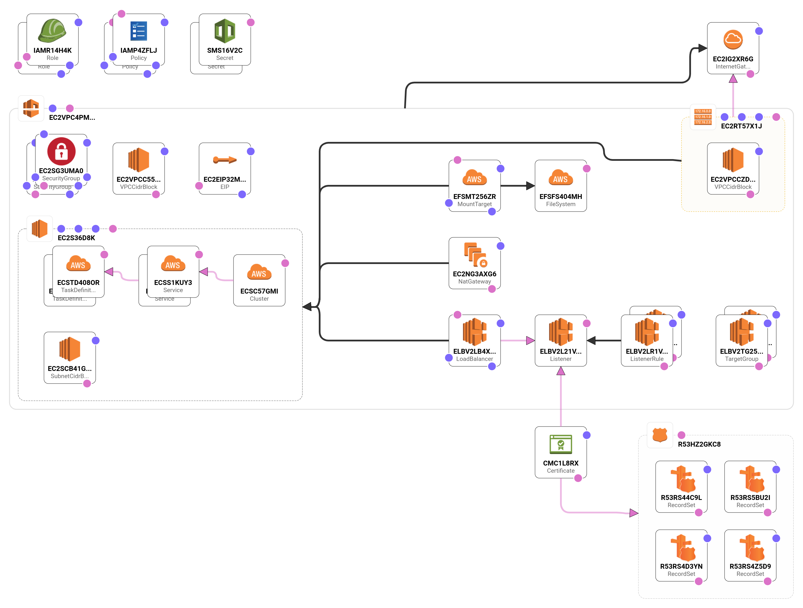
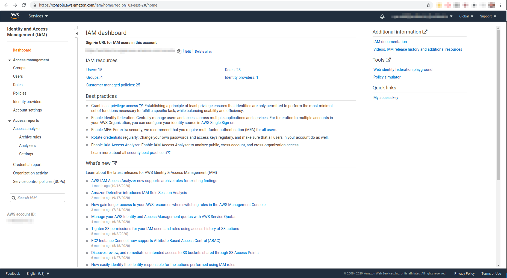
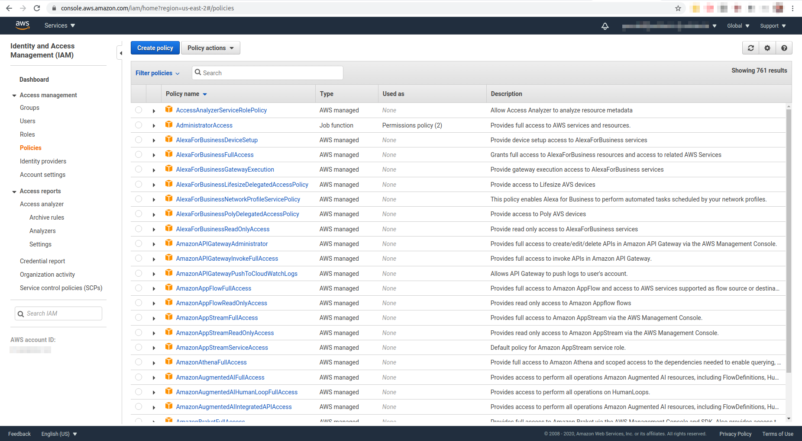

# AWS

## What services does Architect use?

TODO: A list of services we use on AWS. Ideally we'd use a sample app and show what would be provisioned in graph format.

Architect deployments to the AWS ECS platform type will create a variety of services on your behalf in the availability zone provided when the platform was first created. Some resources may or may not be created depending on the components being deployed. Resources created include:

* Load Balancer
* Security Group
* Cert Manager Certificate
* Task Definition
* Security Group
* ECS Service
* Secret Manager Secret / Secret Manager Secrete Version
* VPC
* Internet Gateway
* Subnet
* Elastic IP
* NAT Gateway
* IAM Role
* IAM Policy
* AMI
* Launch Configuration
* Autoscaling Group
* Security Group
* ECS Cluster
* Elastic File System
* Route53 Hosted Zone
* Route53 record
* CloudWatch Event Rule
* CloudWatch Event Target

A generalized architecture for an ECS deployment can be seen below. Amounts of resources vary, such as ECS Cluster Services, depending on the component(s) being deployed to the platform.

## Creating an IAM policy for deployments

### Retrieving a base policy

In order to use Architect to deploy components to your account on AWS, Architect will need the permissions to do so. Permissions are provided for AWS resources by adding an IAM policy to
your account. An example policy can be found [here](https://api.architect.io/accounts/3ed6f3a7-28cf-49b6-88dd-0a54d319045d/aws-iam-policy?region=my_region&aws_account_id=my_account_id), where you simply need to replace `my_region` with your desired AWS region and `my_account_id` with your AWS account ID.

### Creating the custom IAM policy

#### Navigate to the IAM Dashboard

To add the IAM policy to your account, log in to the AWS console and navigate to the IAM dashboard at https://console.aws.amazon.com/iam/home?region=your_target_region#/home. `your_target_region` should be the same region that you plan to use to register your ECS platform with Architect (ex. us-east-2).

#### Create a policy

Select the blue "Create policy" button at the top of the page to create the required policy.

#### Select the JSON editor

On the "Create policy" page, select the JSON editor. This is where the previously-generated policy will be used. Be sure that you have replaced the defaults `my_region` and `my_account_id` with real values. Clear any existing JSON, then paste the policy into the JSON editor. Select the blue "Review policy" button at the bottom of the page to review the policy that will be created.

#### Finish policy creation

On the "Review policy" page, add a policy name then select "Create policy" at the bottom right. You should have been taken back to the policy list page and there should be a message indicating successful policy creation at the top. You can now take this policy and add it to your IAM user.

## Using a custom domain with an Architect ECS platform

